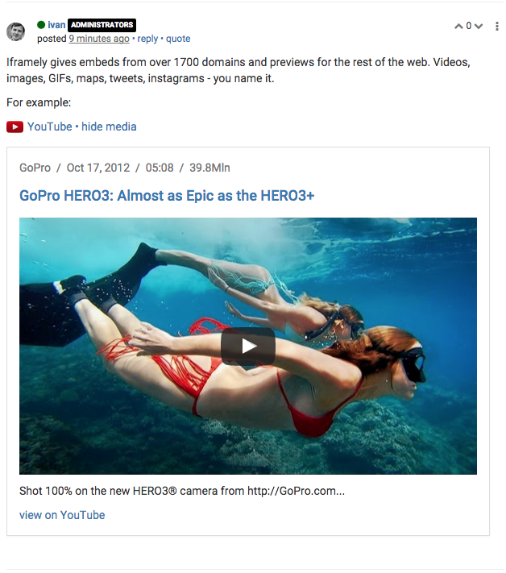

# Iframely for NodeBB

Iframely will give you embeds from over 1700 domains, plus previews for the rest of the web. 

Here's how it looks:

## Features

 * YouTube, Vimeo, SoundCloud, Gists, Twitter, Facebook, Instagrams, Google Maps, Imgur, Giphy, GfyCat, Flickr - you name it. Plus, articles and general links. 
 * You can use it with API key via [cloud service](https://iframely.com), or self-host the [open-source version](https://github.com/itteco/iframely)
 * URL previews are similar to the ones in Twitter feed. They automatically expand or collapse based on the post's popular vote.
 * Optionally use [Camo Image Proxy](https://github.com/atmos/camo) to avoid image hot-linking and mixed-content warnings in SSL.

## Contribute

PRs are welcome, especially language translations. 

If you see a problem - please submit an issue. 

The plugin is maintained by joint effort of Iframely and NodeBB.